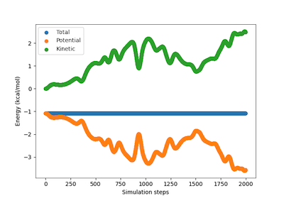

lj-mmcmd
==============================
[//]: # (Badges)

A simple implementation of Metropolis Monte Carlo (MC) simulations and Molecular Dynamics (MD) simulations for Lennard-Jones (LJ) particles

An example can be found at `example.ipynb`.

Potential energies of MC simulations for 50 LJ particles as a function of steps:

Potential energies, kinetic energies, and total energies of MD simulations for 50 LJ particles as a function of steps:

### Copyright

Copyright (c) 2021, Liangyue (Willa) Wang

#### Acknowledgements
 
Project based on the 
[Computational Molecular Science Python Cookiecutter](https://github.com/molssi/cookiecutter-cms) version 1.5.
