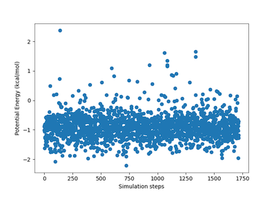
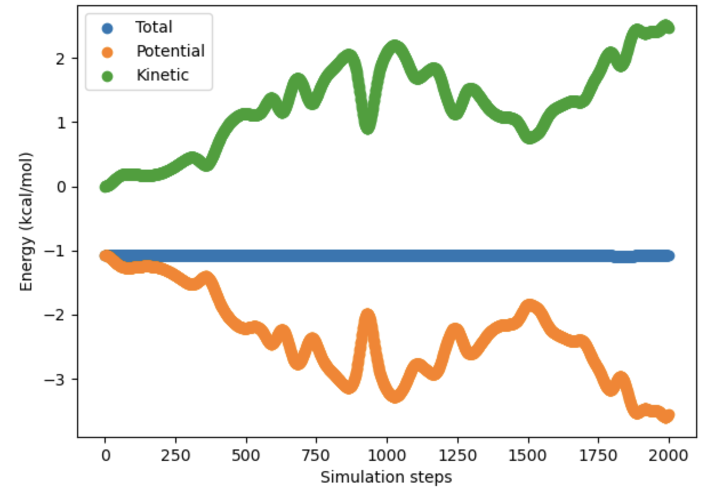

.. lj_mmcmd documentation master file, created by
   sphinx-quickstart on Thu Mar 15 13:55:56 2018.
   You can adapt this file completely to your liking, but it should at least
   contain the root `toctree` directive.

Welcome to lj-mmcmd's documentation!
=========================================================

Getting Started
===============

This page details how to get started with lj-mmcmd.

An example can be found at `example.ipynb`.

API Documentation
=================

.. autoclass:: lj_mmcmd.mclj.MCLJ
    :members:

.. autoclass:: lj_mmcmd.mdvvlj.MDvvlj
    :members:

.. autosummary::
   :toctree: autosummary

    lj_mmcmd.mclj.MCLJ
    lj_mmcmd.mdvvlj.MDvvlj

Indices and tables
==================

* :ref:`genindex`
.. * :ref:`modindex`
* :ref:`search`

Results
=======

Potential energies of MC simulations for 50 LJ particles as a function of steps:

Potential energies, kinetic energies, and total energies of MD simulations for 50 LJ particles as a function of steps:

